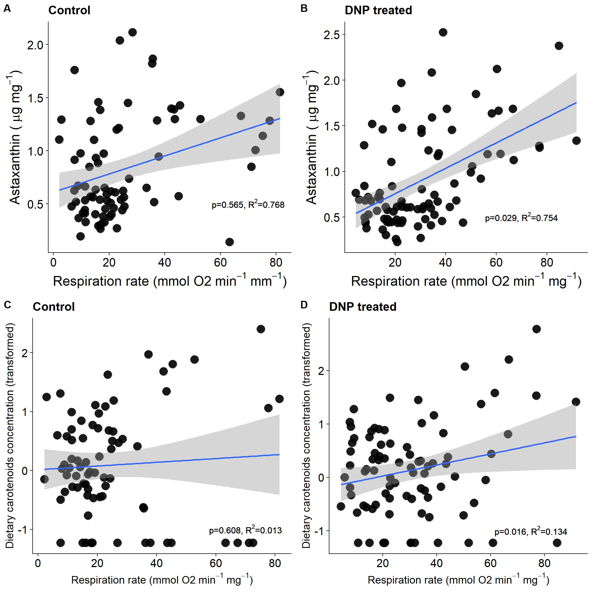
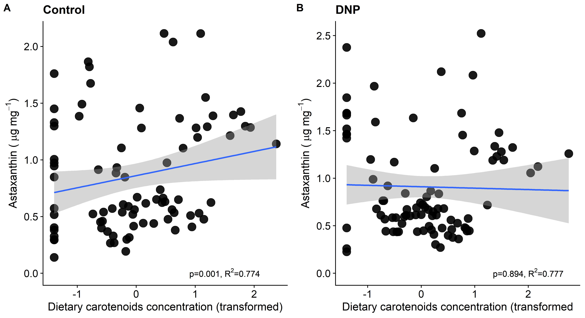

# Chemical manipulation of mitochondrial function affects metabolism of red carotenoids in a marine copepod (*Tigriopus californicus*)

Powers, M.J., Baty, A., Dinga, A.M., Mao, J.H., Hill, G.E. (2022). *Journal of Experimental Biology*, 225,
jeb244230. [doi:10.1242/jeb.244230](https://doi.org/10.1242/jeb.244230) — Hill Lab, Auburn University.

Full analysis code: [`DNP script.R`](Code/DNP%20script.R).

## Overview

The **Shared-Pathway Hypothesis** proposes that red ketocarotenoid pigmentation (e.g. astaxanthin) is an honest
signal of individual quality because the enzymatic pathway that converts yellow dietary carotenoids into red
ketocarotenoids shares biochemical machinery with mitochondrial oxidative phosphorylation (OXPHOS). If true,
experimentally perturbing mitochondrial function should perturb ketocarotenoid production too.

To test this, we exposed *Tigriopus californicus* copepods to **2,4-dinitrophenol (DNP)**, a mitochondrial
protonophore that uncouples the electron transport chain and forces cells to raise their metabolic rate to
compensate. We then measured whole-animal respiration (O₂ consumption) and quantified carotenoids (astaxanthin,
β-carotene, hydroxyechinenone) via HPLC. DNP treatment increased both respiration and astaxanthin accumulation,
and — critically — the relationship *between* respiration and astaxanthin was significant only in DNP-treated
copepods, consistent with a shared biochemical pathway linking the two.


## Study design

Two independently-raised copepod cohorts were used: **red-stock** copepods (naturally pigmented) and
**color-restored** copepods (reared colorless on a carotenoid-free diet, then re-fed *Tetraselmis* algae to
restore pigmentation — isolating dietary carotenoid uptake from endogenous conversion). Both cohorts were exposed
to DNP at multiple concentrations (2µM, 10µM) and durations (3 or 7 days), alongside untreated controls, with sex
tracked throughout given known sexual dimorphism in *T. californicus* carotenoid content. A dose-response survival
assay across a wider concentration range (0–100µM) was run first to select sublethal DNP concentrations for the
respiration/carotenoid experiments.

## Modeling approach

This dataset called for a few different modeling strategies depending on the question:

- **`lm()` with a Group × Sex interaction** (plus a body-mass covariate where relevant) for each individual
  respiration/carotenoid trial — since the effect of DNP frequently depended on sex (see Figure 2 below).
- **`emmeans::emmeans(..., pairwise ~ Group | Sex)`** to pull estimated marginal means and pairwise contrasts
  *within* each sex stratum, with `confint()` for 95% CIs on the DNP-vs-control differences — cleaner than reading
  interaction coefficients directly off the model.
- **`lme4`/`lmerTest` mixed-effects models** (Satterthwaite-approximated df) for analyses pooling data across the
  two independent dietary batches, with **diet fit as a random intercept** rather than a fixed effect — the goal
  was to generalize beyond the two specific diet batches tested, not estimate diet-specific effects.
- **`AIC()` model comparison** between the mixed-effects specification and an equivalent fixed-effects `lm()`, to
  make the random-effects decision explicit rather than assumed (see Figure 5 below — AIC actually favors the
  simpler fixed-effects model here, which is a genuinely interesting case to reason through).
- **`MuMIn::r.squaredGLMM()`** to decompose R² into marginal (fixed effects only) vs. conditional (fixed +
  random) variance explained.
- **`bestNormalize::bestNormalize()`** to select a data-driven transformation (ordered quantile normalization) for
  a right-skewed dietary carotenoid variable before modeling it with a Gaussian error structure.

## Figure 2 — Respiration response to DNP (red-stock copepods)

Ridgeline plots of whole-animal respiration rate, by DNP concentration, exposure duration, and sex:


| Trial | Sex | DNP effect | 95% CI | Result |
|---|---|---|---|---|
| 10µM, 3 days | Male | +0.53 mmol O₂/min | 0.036 – 1.01 | Significant increase |
| 10µM, 3 days | Female | +0.97 mmol O₂/min | 0.40 – 1.53 | Significant increase |
| 10µM, 7 days | Male | — | — | Not significant |
| 10µM, 7 days | Female | — | — | Not significant |
| 2µM, 7 days | Male | +0.35 mmol O₂/min | 0.026 – 0.67 | Significant increase |
| 2µM, 7 days | Female | −0.31 mmol O₂/min | −0.60 – −0.023 | Significant decrease |

The 2µM/7-day trial is the clearest case where the Group × Sex interaction mattered — DNP pushed male and female
respiration in *opposite* directions. That's the `mod.4` fit, with `emmeans` estimating the sex-specific contrasts
directly:

<details>
<summary><b>Sex-stratified DNP effect on respiration</b> — <code>emmeans(mod.4, pairwise ~ Group | Sex)</code></summary>

```r
confint(emmeans(mod.4, pairwise ~ Group | Sex))
# mod.4 <- lm(abs(Slope_ppm_per_min) ~ Group * Sex + Weight_mg, data = datum5)  [2uM, 7-day trial]

$emmeans
Sex = Female:
 Group   emmean     SE df lower.CL upper.CL
 Control  1.116 0.1080 45    0.898    1.334
 DNP      0.805 0.0943 45    0.615    0.995

Sex = Male:
 Group   emmean     SE df lower.CL upper.CL
 Control  0.632 0.1130 45    0.404    0.861
 DNP      0.981 0.1130 45    0.753    1.209

$contrasts
Sex = Female:
 contrast      estimate    SE df lower.CL upper.CL
 Control - DNP    0.311 0.144 45   0.0218   0.6009

Sex = Male:
 contrast      estimate    SE df lower.CL upper.CL
 Control - DNP   -0.349 0.160 45  -0.6710  -0.0264
```

</details>

## Figure 3 — Astaxanthin response to DNP (red-stock copepods)


At 10µM for 3 days, astaxanthin concentration didn't differ from controls in either sex. At 2µM for 7 days,
astaxanthin increased in both sexes, reaching significance in males (+0.67 µg/mg tissue, 95% CI 0.23 – 1.10).

## Figure 4 — Color-restored copepods: respiration and astaxanthin

Repeating the 2µM/7-day trial in copepods that had been reared colorless and only recently re-fed algae to
restore pigmentation — isolating the conversion step from a copepod's baseline pigment reserve:


DNP significantly increased respiration in males (β = 0.20 mmol O₂/min, 95% CI 0.014 – 0.39) and significantly
increased astaxanthin in females (β = 0.098 µg/mg, 95% CI 0.0091 – 0.19) — the same pattern of a sex-dependent DNP
effect seen in Figure 2, now replicated in an independent cohort raised under different dietary history.

## Figure 5 — The central test: does respiration predict astaxanthin, and only under DNP?

This is the direct test of the Shared-Pathway Hypothesis: pooling across all experiments, is there a relationship
between respiration rate and astaxanthin concentration (controlling for sex, with diet as a random effect), and
does that relationship depend on DNP treatment?



There is — and it's DNP-specific. The same pattern held for dietary carotenoids vs. respiration (not shown in
detail here): a significant positive relationship in DNP-treated copepods only.

<details>
<summary><b>Astaxanthin ~ respiration, DNP-treated copepods</b> — <code>lmer</code>, diet as random intercept</summary>

```r
summary(mod.asta.vs.resp.DNP)
# asta.conc ~ abs(resp.min.mg) + sex + (1 | diet), data = subset(carotenoid.datum, treatment == "DNP")

Random effects:
 Groups   Name        Variance Std.Dev.
 diet     (Intercept) 0.14353  0.3789  
 Residual             0.09736  0.3120  
Number of obs: 87, groups: diet, 2

Fixed effects:
                  Estimate Std. Error        df t value Pr(>|t|)  
(Intercept)       0.711916   0.278853  2.250403   2.553   0.1115  
abs(resp.min.mg)  0.004577   0.001992 85.737159   2.298   0.0240 *
sexM              0.165379   0.068513 85.106707   2.414   0.0179 *
```

```r
r.squaredGLMM(mod.asta.vs.resp.DNP)
#         R2m       R2c
# 0.05781093 0.6191921
```

Respiration significantly predicts astaxanthin (p = 0.024) — but the marginal R² (fixed effects alone, 5.8%) is
far smaller than the conditional R² (fixed + diet random effect, 61.9%), meaning most of the variance sits
between the two diet batches rather than within the respiration effect itself. The effect is real, but modest
relative to batch-level variation — exactly the kind of nuance a bare significance star would hide.

</details>

<details>
<summary><b>Astaxanthin ~ respiration, Control copepods</b> — same model, no DNP</summary>

```r
summary(mod.asta.vs.resp.control)
# asta.conc ~ abs(resp.min.mg) + sex + (1 | diet), data = subset(carotenoid.datum, treatment == "Control")

Random effects:
 Groups   Name        Variance Std.Dev.
 diet     (Intercept) 0.29268  0.5410  
 Residual             0.08892  0.2982  
Number of obs: 77, groups: diet, 2

Fixed effects:
                  Estimate Std. Error        df t value Pr(>|t|)
(Intercept)       0.858910   0.389152  1.049094   2.207    0.261
abs(resp.min.mg) -0.001211   0.002094 73.305832  -0.578    0.565
sexM              0.046572   0.068424 73.017446   0.681    0.498
```

```r
r.squaredGLMM(mod.asta.vs.resp.control)
#          R2m       R2c
# 0.002704524 0.7676196
```

No relationship between respiration and astaxanthin in untreated copepods (p = 0.565, marginal R² ≈ 0.3%) — the
respiration–astaxanthin link only appears once mitochondrial function has been chemically perturbed.

</details>

<details>
<summary><b>Was the mixed-effects model actually justified?</b> — <code>AIC()</code> comparison</summary>

```r
AIC(mod.asta.vs.resp.DNP2, mod.asta.vs.resp.DNP)
#                       df      AIC
# mod.asta.vs.resp.DNP2  5 52.21073   <- lm(), diet as a fixed effect
# mod.asta.vs.resp.DNP   5 62.58730   <- lmer(), diet as a random intercept
```

AIC alone actually favors the simpler fixed-effects model here. The mixed-effects specification was kept anyway,
because the two diet batches are treated as a random sample from a broader population of possible rearing
conditions — the scientific question is whether the respiration–astaxanthin relationship generalizes beyond these
two specific batches, not whether these two batches differ. That's a modeling decision driven by what the
random effect is meant to represent, not by which model minimizes AIC.

</details>

## Figure 6 — Does DNP break the normal diet-to-pigment relationship?



Dietary carotenoid concentration predicted astaxanthin concentration significantly in **control** copepods
(β = 0.12, 95% CI 0.050 – 0.18) but not in DNP-treated copepods. Combined with Figure 5, this suggests that under
normal conditions astaxanthin production tracks dietary carotenoid supply, but once mitochondrial function is
perturbed by DNP, production instead tracks respiration/metabolic rate — decoupling from raw substrate
availability and shifting toward the proposed shared enzymatic pathway.

## Methods at a glance

- **Dose selection:** `lm()` dose × day interaction on survival proportions, `emmeans` pairwise contrasts by day
- **Per-trial group comparisons:** `lm(response ~ Group * Sex [+ covariate])`, `emmeans` sex-stratified pairwise
  contrasts with 95% CIs
- **Cross-experiment pooled models:** `lme4`/`lmerTest` mixed-effects models with diet as a random intercept,
  Satterthwaite-approximated degrees of freedom
- **Model justification:** `AIC()` comparison of fixed- vs. mixed-effects specifications;
  `MuMIn::r.squaredGLMM()` for marginal/conditional R²
- **Transformation selection:** `bestNormalize` for non-normal predictors
- **Carotenoid quantification:** HPLC, identifying and quantifying astaxanthin, β-carotene, and hydroxyechinenone
- **Visualization:** `ggplot2`, `ggridges`-style density ridgelines (`geom_density_ridges_gradient`), `ggpubr`
  multi-panel figure assembly

Full pipeline is in [`DNP script.R`](Code/DNP%20script.R).

## Citation

Powers, M.J., Baty, A., Dinga, A.M., Mao, J.H., Hill, G.E. (2022). Chemical manipulation of mitochondrial function
affects metabolism of red carotenoids in a marine copepod (*Tigriopus californicus*). *Journal of Experimental
Biology*, 225, jeb244230. https://doi.org/10.1242/jeb.244230

